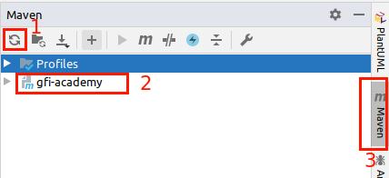
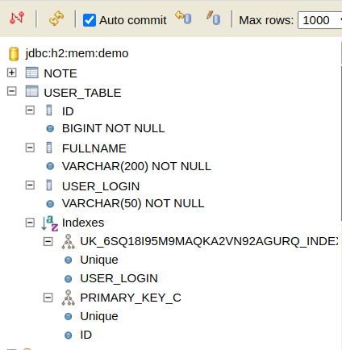

**Witaj w repozytorium Akademii GFI**

Aby pobrać to repozytorium wpisz komendę

`git clone https://mmaksymiuk@bitbucket.org/mmaksymiuk/gfi-academy.git`

Linki wykorzystywane podczas szkolenia

- https://projectlombok.org/
- https://mvnrepository.com/
- https://start.spring.io/


**Zadanie 1. : Import i uruchomienie projektu**
 
Pierwszym zadaniem jest otwarcie projektu w IDE Intellij IDEA.
Plik pom.xml powinien zostać rozpoznany przez IDE i powinno rozpocząć się pobieranie bibliotek.
Jeśli do tego nie doszło. Kliknij na plik pom.xml PPM i wybierz opcję: *Add as Maven Project*



Po prawej stronie zostanie dodana zakładka Maven.
W każdej chwili, aby ręcznie wymusić odświeżenie projektu (w tym pobranie bibliotek) kliknij na przycisk nr 1.
Zaznaczenie nr 2, pokazuje jaki projekt został zaimportowany.
Klikając w nazwę (nr 3) zakładki możemy ją zwinąć lub rozwinąć.

Po imporcie projektu uruchom projekt.
W tym celu przejdź do klasy **MyNoteApp.java** i uruchom metodę **main**.

Zadanie jest zaliczone w momencie wyświetlenia w consoli logów informacji:
`Started MyNoteApp in 3.69 seconds (JVM running for 4.459)`
oraz otwarciu w przeglądarce linku

 - http://localhost:8080/actuator/health
 
Jeśli przeglądarka wyświetla wiadomość w formacie JSON o treści:

`{"status":"UP"}`

Zatrzymaj aplikację `MyNoteApp`.
Możesz przejść do kolejnego zadania.
Pobierz branch **zadanie2**.

**Zadanie 2. : Zmiana property, definiowanie własnych property, odczyt wartości przez adnotacje @Value**

Domyślnym plikiem wczytywanym przez framework SpringBoot jest **application.properties** z katalogu resources.
Więcej o kolejności ładowania konfiguracji znajdziesz pod linkiem: https://docs.spring.io/spring-boot/docs/2.1.13.RELEASE/reference/html/boot-features-external-config.html

Wyłącz logo spring które wyświetlane jest w konsoli logów.

Property `spring.main.banner-mode` musi mieć wartość `off`

Uruchom aplikację i sprawdź czy banner spring został wyłączony.

Zmień wartości custom properties, które są wyświetlane w konsoli jak poniżej:

`+++++ Custom String value = [default] +++++`

`+++++ Custom Long value = [0] +++++`
 
Ustaw wartości property w pliku application.properties:
 - `custom.string`
 - `custom.long`
 
Twoje wartości powinny pojawić się w konsoli.

Sprawdź co się stanie jeśli pod wartość liczbową podstawisz wartość, która nie jest liczbą całkowitą.

Sprawdź co się stanie jeśli property nie będzie ustawione w pliku application.properties oraz w pliku **MainConfiguration**
wartość adnotacji `@Value("${custom.string:default}")` zmienisz do `@Value("${custom.string}")`

Pobierz branch **zadanie3**

**Zadanie 3. : Ustawienia logów, logback - plik konfiguracyjny**

Zapoznaj się z poniższą tabelką poziomów logowania


SpringBoot dostarcza biblioteki potrzebne do używania loggerów, a Lombok skraca dodawanie logger do dodania adnotacji nad klasą.

`Logger log = LoggerFactory.getLogger(MainConfiguration.class);`

można zastąpić

`@Slf4j`

Aby zmienić poziom logowania z poziomu property wystarczy dodać wpis:
`logging.level.nazwa_logger=POZIOM_LOGOWANIA`

Poziom logowania można wybrać zgodnie z tabelką.

Użycie logów znajdziesz w klasie **MainConfiguration**

W pliku **application.properties** zmień poziom logowania
`logging.level.myLogger` na DEBUG i uruchom/zerestartuj aplikację. Obserwuj logi konsoli.

Odkomentuj linię `logging.config=classpath:./logging.xml` i zrestartuj aplikację.
Czy w projekcie pojawił się nowy plik o nazwie `logFile.log`?

Sprawdź zawartość pliku `logging.xml` w katalogu resources.

Pobierz branch **zadanie4**

**Zadanie 4. : Adnotacje springa, beany i kontener IoC**

Kontener IoC (eng. Inversion of Controll) pozwala na definiowanie klas i używanie ich obiektów bez myślenia o ich inicjalizacji.

W większości przypadków nie będziemy nigdzie korzystać ze słowa kluczowego **new**

**@Configuration** wskazuje klasę konfiguracji, która powinna definiować przynajmniej jeden bean.

Czym jest bean? To obiekt zarządzany przez Spring Framework. Jest to instancja klasy.

**@Bean** adnotacja nad metodą, która definiuje nowego beana.

**@Service, @Controller, @Repository** - adnotacje nad klasą, prototypy logiczne, spełniają tą samą funkcję, wskazują aby utworzyć bean-a na podstawie tej klasy

**@Autowired** - może być użyty nad polem, metodą (setter), konstruktorem (zalecane), wskazuje, gdzie należy wstrzyknąć bean-a.

**Do poczytania**:
 - zakresy beanów - bean scopes (singleton - domyślny, prototype) oraz (request, session)
 - zasady wstrzykiwania (po typie, po nazwie, po qualifier) - @Qualifier oraz @Bean(name="")
 
Ćwiczenie.

Używając adnotacji @Autowired i @Service zainicjalizuj klasę `OtherService` tak, aby w konsoli pojawiło się drukowanie imiona z klasy `UserService`

Używając adnotacji @Bean zainicjalizuj w klasie `MainConfiguration` drugą instancję serwisu `OtherService`.

Jeśli w logu konsoli posiadasz dwa razy wpis:
```
===== Printing name in UserService.
===== Name is: NAME FROM NOTE
```

pobierz branch **zadanie5**

**Zadanie 5. : @RestController, @RequestMapping, @GetMapping, parametry**

Adnotacja @RestController pochodzi z `spring-boot-starter-web`.
Biblioteka zawiera wbudowany serwer tomcat. Jest to serwer z kontenerem servletów.
Dodatkowo wprowadza wszystkie konfiguracje wymagane, do wystawienia kontrolera REST.

Klasa `ExampleServlet` pokazuje przykład inicjalizowania servletu java. 
Nie będzie on działać przy obecnej konfiguracji.
Ma zadanie zaprezentować implementację servletu od podstaw.

Ćwiczenie
Uruchom aplikację i w przeglądarce otwórz link:
http://localhost:8080/note
Teraz otwórz link
http://localhost:8080/note/TUTAJ_TWÓJ_PARAMETR

W klasie `UserController` dodaj odpowiednie adnotacje i 2 metody odpowiadające na żądania GET
- Pierwsza metoda ma odpowiadać pod URI `/user` i zwracać listę osób (jako typ zwracany ustaw List<String>)
- Druga metoda ma odpowiadać pod URI `/user/{PARAM_TEXT}/{PARAM_NUMBER}` i zwracać typ `ResponseEntity<String>`:
- Pierwszy parametr ma być typu String.
- Drugi parametr ma być typu Long.
- Po wywołaniu w logach konsoli ma pojawić się przesłany text i liczba.
- Log ma być wpisany z poziomem ERROR
- Odpowiedź HTTP ma mieć kod 201 (patrz metody klasy ResponseEntity)
- Wiadomośc w odpowiedzi ma zawierać słowo "PRINTED"

Jeśli ukończyłeś zadanie pobierz branch **zadanie6**

**Zadanie 6. : Zapoznanie z swagger-ui**

Swagger to biblioteka, która pozwala na dokumentowanie API co sprawdza się w pracach między zespołami.
Więcej informacji znajdziesz na https://swagger.io/
W tym zadaniu zapoznamy się tylko z interfejsem, które dostarcza biblioteka **swagger-ui**

Uruchom aplikację i przejdź na adres:

http://localhost:8080/swagger-ui.html

Jeśli ukończyłeś zadanie pobierz branch **zadanie7**

**Zadanie 7. : Zapoznanie z konsolą bazy danych**

Zależność
```
   <dependency>
       <groupId>com.h2database</groupId>
       <artifactId>h2</artifactId>
   </dependency>
```
dostarcza sterownik i silnik bazy danych H2. Baza ta zapisuje dane w pamięci operacyjnej lub w pliku.
Baza danych zazwyczaj jest dodawana ze scope **test**, ponieważ wykorzystywana jest przy testowaniu aplikacji.
Na potrzeby szkolenia dodana została z domyślnym scope **compile**. Oznacza to, że biblioteki zostaną dołączone
do classpath.
Pozwoli to na wykorzystanie bazy w naszej testowej aplikacji bez konieczności wykorzystania zewnętrznego silnika bazodanowego.

Sprawdź zawrtość pliku **application.propeties** i zapoznaj się z opisem ustawień.

Uruchom aplikację i przejdź do przeglądarki pod adres:

http://localhost:8080/h2

Zaloguj się do konsoli wykorzystując wartości property z pliku **application.properties**

Wykonaj zapytanie o dane z tabeli **TEST**

`SELECT * FROM TEST`

Jeśli wyświetliła się tabela z danymi, zadanie zostało wykoanne.
Pobierz branch **zadanie8**

**Zadanie 8. : Klasa encji i testowe dane**

Dane początkowe ładowane są z pliku data.sql.
Wykorzystują one model bazodanowy, który tworzony jest przez Spring Data.

Sprawdź klasę `Note` i zapoznaj się z adnotacjami stosowanymi w klasie encji.
Jeśli znasz składnie SQL, możesz także spojrzeć do pliku `data.sql`

Bazując na klasie `Note` i dodaj konfigurację do klasy encji `User`, aby aplikacja uruchomiła się poprawnie.

Poniższe informacje będą pomocne:
- Klasa `User` odpowiada tabeli `USER_TABLE`
- pole login odpowiadać powinno kolumnie `USER_LOGIN`
- kolumna `USER_LOGIN` powinna mieć unikalną wartość, nie może przyjmować wartości NULL, wartość może mieć maksymalnie 50 znaków.
- pole fullName odpowiada kolumnie `FULLNAME`, nie może przyjmować wartości NULL, wartość może mieć maksymalnie 200 znaków.

Z poziomu konsoli h2 powinno to wyglądać następująco:

FULLNAME - VARCHAR(200) NOT NULL
USER_LOGIN - VARCHAR(50) NOT NULL
Indexes powinno zawierać indeks UNIQUE na polu USER_LOGIN

Po ukończeniu zadania pobierz branch **zadanie9**

**Zadanie 9. : Repozytorium JPA**

Spring Data w wysokim stopniu upraszcza pisanie repozytoriów pobierających dane z bazy.
Wystarczy, aby interfejs reprezentujący nowe repozytorium rozszerzał interfejs `org.springframework.data.jpa.repository.JpaRepository<T, ID>`.
Oto zestaw metod które dostarcza JpaRepository
```
    List<T> findAll();
    List<T> findAll(Sort var1);
    List<T> findAllById(Iterable<ID> var1);
    <S extends T> List<S> saveAll(Iterable<S> var1);
    void flush();
    <S extends T> S saveAndFlush(S var1);
    void deleteInBatch(Iterable<T> var1);
    void deleteAllInBatch();
    T getOne(ID var1);
    <S extends T> List<S> findAll(Example<S> var1);
    <S extends T> List<S> findAll(Example<S> var1, Sort var2);
```
T - klasa encji

ID - klasa atrybutu identyfikatora encji

Spring zajmie się resztą: 
 - Utworzy bean repozytorium. 
 - Odpowie za generowanie zapytań do bazy danych.
 - Utworzenie puli połączeń do bazy danych (domyślnie wykorzystując HikariCP)
 - Mapowanie obiektów bazodanowych na obiekty klasy encji.

W przypadku utworzenia zapytań z parametrami `where` (wybór rekordów na podstawie wartości pola) lub `order` (sortowanie pobranych obiektów),
wystarczy dodać w repozytorium deklarację metody wg schematu:

`[List|Optional]<T> find[All]ByNazwaAtrybutu[[And|Or]NazwaKolejnegoAtrybuty][OrderByNazwaAtrybuty](Parametry...)`

np. wyszukując użytkowników których login rozpoczyna się od zadanego ciągu znaków i posortowanych po id deklarujemy metodę:

`List<User> findAllByLoginStartsWithOrderByIdAsc(String login)` 

Ćwiczenie.

Uzupełnij interfejes `UserRepository` tak, aby deklarował bean repozytorium encji `User`
Napisz deklarację metody w klasie `NoteRepository`, aby pobierała notatki użytkownika o podanym `userId`.
Dopisz w klasie `NoteController` brakującą adnotację i wywołanie nowej metody z `NoteRepository`.

Sprawdź z poziomu swagger-ui poprawność działania kontrolerów.

Pobierz branch **zadanie10**

**Zadanie 10. : Serwisy i obsługa błędów**

Pomiędzy warstwę repozytoriów, a warstwę kontrolerów wprowadzona została warstwa serwisów.

Zostały także utworzone 2 dedykowane wyjątki, które mają za zadanie reprezentować błędy związane z brakiem danych.

Klasa `DedicatedExceptionHandler` posiada adnotację **@ControllerAdvice**, która wskazuje, że będzie ona zapewniać obsługę wyjątków.
Obecnie klasa obsługuje wyjątek `UserNotFoundException`.

Ćwieczenie.

Uruchom aplikację. Z poziomu swagger-ui, wyślij request do `UserController` w celu wyszukania użytkownika o błędnym id.
To samo wykonaj przy notatce.
Sprawdź logi konsoli.
Dopisz brakującą obsługę wyjątku `NoteNotFoundException` w klasie `DedicatedExceptionHandler`.

Pobierz branch **zadanie11**

**Zadanie 11. : Mapowanie obiektów**

Pobierając obiekty notatek poprzez REST API pobierane są dane o użytkownikach, do których przypisane są notatki.

```$json
{
  "id": 1,
  "title": "Sterowanie lądownikiem",
  "importance": "HIGH",
  "text": "Rozdział 8 w podręczniku pilota zawiera informacje na temat sterowania lądownikiem",
  "creationDate": "2020-04-20T18:57:32.892075Z",
  "modificationDate": "2020-04-20T18:57:32.892075Z",
  "user": {
    "id": 1,
    "login": "armn",
    "fullName": "NeilArmstrong"
  }
}
```

Dodatkowo data podawana jest w formacie ISO 8601 z czasem w strefie UTC.

Aby zapanować nad danymi pobieranymi przez API REST warto używać klas reprezentacji.

Ćwiczenie.

- Uruchom aplikację.
- Z poziomu swagger-ui pobierz notatki i użytkowników.
- Wczytaj pojedynczego użytkownika
- Sprawdź modele reprezentacji i sposoby mapowania.
- Zwróć uwagę na adnotacje `@JsonIgnore` i `@JsonFormat`w klasie `NoteRepresentation
- Zwróć uwagę na wykorzystanie biblioteki orika do mapowania obiektu w klasie `UserToUserWithNoteRepresentation`
- Więcej o bibliotece orika znajdziesz na https://github.com/orika-mapper/orika i http://orika-mapper.github.io/orika-docs/

Pobierz branch **zadanie12** 

Finalna aplikacja została podzielona na 3 moduły.

**gfi-academy-core** jest modułem, który dostarcz pozostałym bibliotekę z funkcjonalnościami aplikacji. Wygenerowany JAR nie jest
wykonywalny i nie może posłużyć do uruchomienia aplikacji.

**gfi-academy-jar** to moduł, który pozwala na uruchomienie apliakcji jako wykonywalny JAR.
Po zbudowaniu projektu w katalogu target znajdzie się JAR, który można uruchomić poleceniem
`java -jar gfi-academy-jar-0.0.1-SNAPSHOT.jar`

**gfi-academy-war** to moduł, który ma za zadanie zbudować archiwum WAR, na potrzeby deploymentu w serwer aplikacyjnych.
Moduł dostarcza także deskryptor wdrożenia (web.xml), jboss-web.xml - plik konfiguracyjny na potrzeby serwera wildfly(jboss), oraz
w pliku pom.xml jest generowana konifguracja manifestu. Logging-profile jest potrzeby, aby w serwerze wildfly można było kontrolować 
logi konkretnej aplikacji. Gotowe archiwum WAR znajduje się w katalogu target po zbudowaniu projektu. 